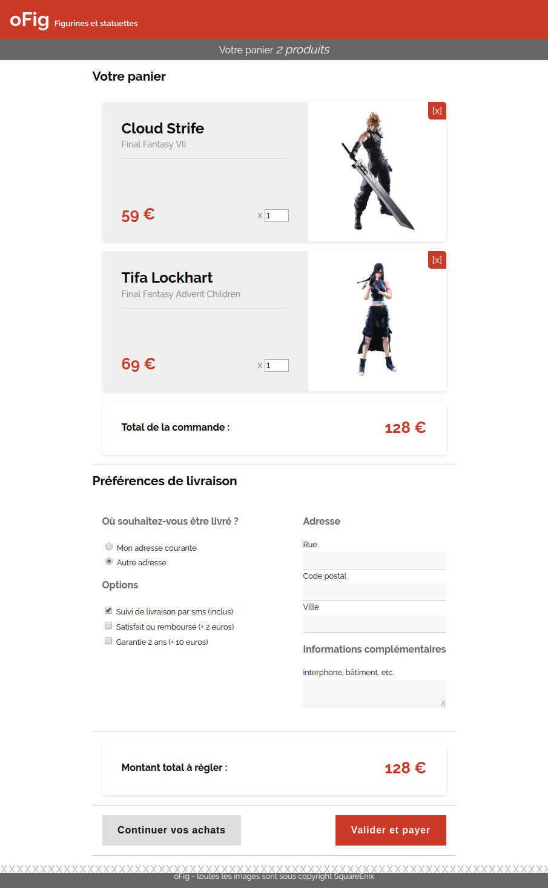

# oFig - Panier

Vous vous souvenez de oFig ? Avec les petites figurines ? Bon et bien continuons alors :) 

## Objectif

Réaliser la page panier du site

Pour le formulaire vous savez comment faire mais pour l'affichage du panier... Certes il est possible de s'en sortir avec des div et autres mais il existe un outil plus adapté pour structurer des tableaux.

Je vous propose un peu de lecture histoire de se mettre dans le bain : https://developer.mozilla.org/fr/docs/Apprendre/HTML/Tableaux/Basics

Ensuite, je vous propose de reprendre le code la boutique fait ensemble, vous aurez images et css de base pour repartir sur de bonnes bases.

Bon courage ;)
